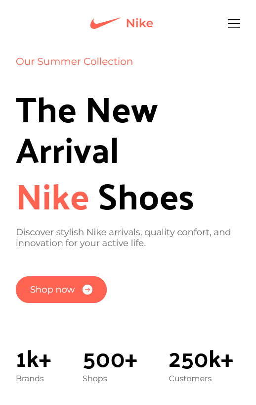
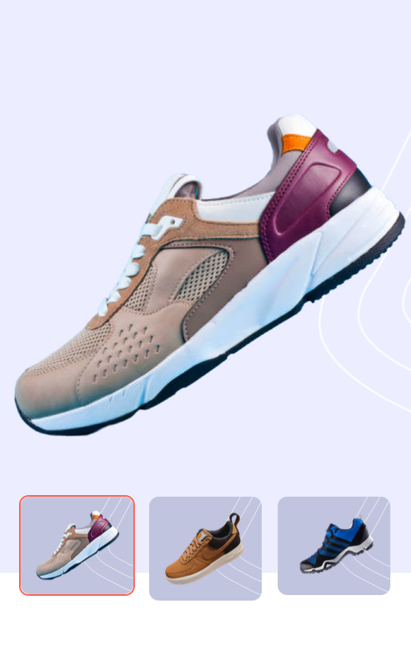
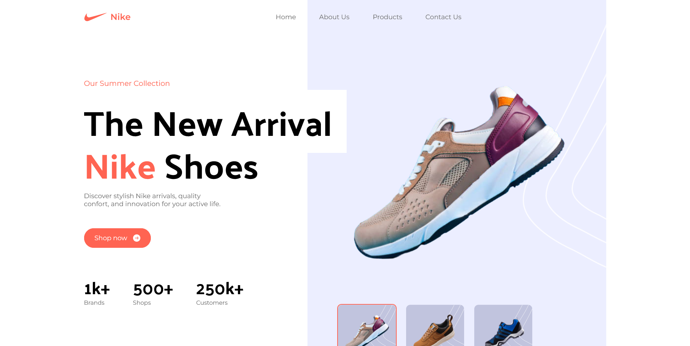

# Nike Landing Page

This project reflects my first experience with Tailwind CSS. While primarily following a YouTube tutorial, this experience has expanded my knowledge and skills.

## What I've Learned

Throughout this project, I've gained the following insights and skills:

- **Tailwind CSS Proficiency**: I've learned to effectively use Tailwind CSS, a utility-first CSS framework, streamlining my web development workflow.

- **Behind the Scenes**: I now have a deeper understanding of how Tailwind CSS works under the hood. This knowledge has allowed me to use the framework more effectively and make customizations as needed.

- **Best Practices**: I've adopted industry best practices for writing clean, maintainable, and efficient code, emphasizing the importance of coding principles.

- **Component Reusability**: One of the key takeaways from this project is the ability to create reusable components. This approach not only saves time but also ensures consistency in design and functionality.

## Live preview

### Mobile (Hero section)

### Desktop (Hero section)

## Links
- Live site URL: [Nike](https://nike-landing-page-amy0h.netlify.app/)
- Repository: [Github Repository](https://github.com/amy0h/nike-landing-page)